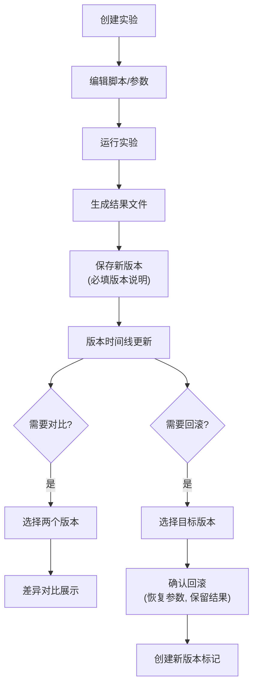

## 1. 产品概述

实验版本记录系统是面向研究人员的实验数据管理工具，用于追踪数据处理脚本、参数配置和结果文件的完整演化历史。系统解决科研实验中版本混乱、对比困难、回滚复杂的问题，帮助研究人员高效管理实验迭代过程。

- 核心价值：为科研实验提供可追溯、可对比、可回滚的完整版本管理能力
- 目标用户：数据科学家、算法研究员、科研工作者

## 2. 核心 Features

### 2.1 用户角色

| 角色 | 注册方式 | 核心权限 |
|------|----------|----------|
| 研究人员 | 本地登录/匿名使用 | 创建实验、保存版本、对比差异、回滚版本 |

### 2.2 Feature Module

1. **实验概览页**：实验列表展示、快速搜索、新建实验入口
2. **实验详情页**：版本时间线、脚本/参数/结果展示、版本操作
3. **版本创建**：保存当前脚本、参数、结果文件，填写版本说明
4. **版本对比**：选择两个版本进行脚本和参数的差异对比
5. **版本回滚**：恢复历史版本的参数配置，保留所有结果文件

### 2.3 Page Details

| 页面名称 | 模块名称 | Feature 描述 |
|----------|----------|--------------|
| 实验概览页 | 实验列表 | 卡片式展示所有实验，显示最新版本号、更新时间、版本数量 |
| 实验概览页 | 搜索筛选 | 按名称搜索实验，按创建时间/更新时间排序 |
| 实验概览页 | 新建实验 | 弹窗表单，输入实验名称、描述、初始脚本和参数 |
| 实验详情页 | 版本时间线 | 垂直时间线展示所有版本，标记当前版本、版本说明、创建时间 |
| 实验详情页 | 内容展示区 | Tab 切换显示脚本、参数、结果文件列表，支持代码高亮 |
| 实验详情页 | 版本操作栏 | 保存新版本、选择对比版本、回滚到指定版本 |
| 版本对比页 | 差异对比 | 左右分栏显示两个版本的脚本和参数差异，高亮增删改内容 |
| 版本回滚弹窗 | 回滚确认 | 显示回滚影响范围，确认恢复参数但保留新结果文件 |

## 3. 核心流程

### 3.1 主业务流程

研究人员创建实验 → 编辑脚本和参数 → 运行实验生成结果 → 保存版本（必填版本说明）→ 迭代多轮实验 → 选择两个版本对比差异 → 如需回滚，确认恢复历史参数但保留所有结果

## 4. User Interface Design

### 4.1 Design Style

- **主色调**：深邃科技蓝 (#1e3a5f) 作为主色，搭配专业感的青绿色 (#2dd4bf) 作为强调色
- **辅助色**：成功绿 (#10b981)、警告橙 (#f59e0b)、错误红 (#ef4444)、差异红 (#fecaca)、差异绿 (#bbf7d0)
- **背景**：深色主题 (#0f172a)，适合长时间阅读代码和数据
- **字体**：代码使用 JetBrains Mono，正文使用 Inter，营造专业科研氛围
- **按钮风格**：扁平化设计，圆角 6px，悬停时轻微上浮和阴影
- **布局风格**：侧边导航 + 主内容区，卡片式容器，清晰的视觉层级

### 4.2 Page Design Overview

| 页面名称 | 模块名称 | UI Elements |
|----------|----------|-------------|
| 实验概览页 | 顶部导航 | 深色导航栏，系统名称，用户信息 |
| 实验概览页 | 实验卡片 | 悬停微动效，显示实验名称、最新版本、描述标签、操作按钮 |
| 实验详情页 | 版本时间线 | 左侧垂直时间线，节点带状态图标，可点击切换版本 |
| 实验详情页 | 内容区域 | Tab 切换（脚本/参数/结果），代码编辑器风格展示区 |
| 实验详情页 | 操作栏 | 固定在底部的操作栏，包含「保存版本」「对比」「回滚」按钮 |
| 版本对比页 | 差异视图 | 左右分栏，同步滚动，行号显示，差异行高亮背景色 |
| 弹窗 | 表单验证 | 版本说明输入框实时校验，禁止为空，错误提示友好 |

### 4.3 Responsiveness

- 桌面端优先设计（1280px 及以上）
- 平板端：自适应布局，时间线可收起为下拉选择
- 移动端：卡片单列布局，Tab 改为底部导航

### 4.4 交互细节

- 版本保存：按钮点击后显示加载状态，成功后时间线动画插入新版本
- 差异对比：行级差异高亮，鼠标悬停显示差异详情 tooltip
- 回滚操作：二次确认弹窗，明确说明「参数将恢复，结果文件保留」
- 代码展示：语法高亮，行号显示，支持复制到剪贴板
