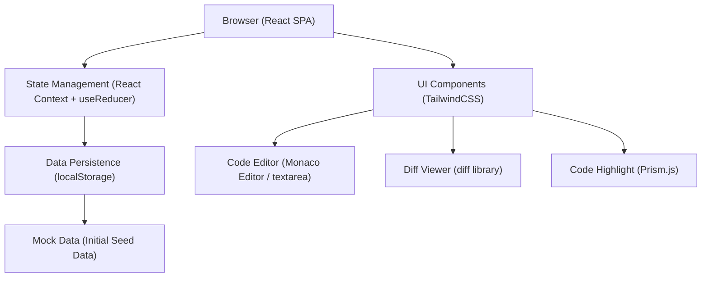
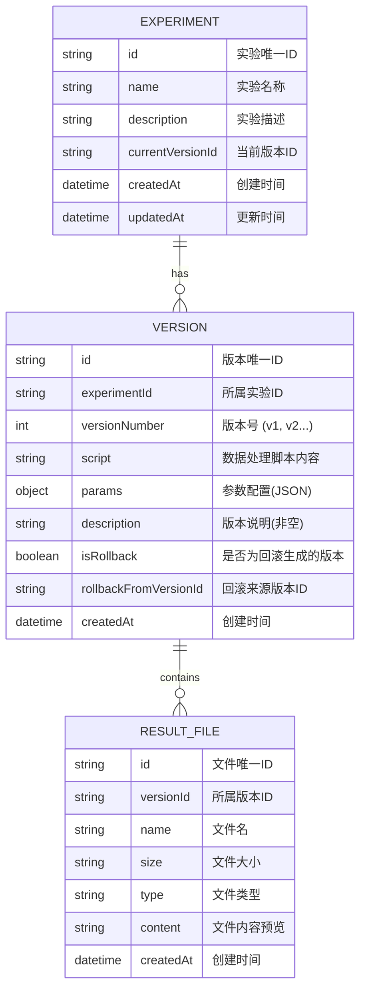

## 1. Architecture Design



## 2. Technology Description

- **Frontend Framework**: React@18 + TypeScript@5 + Vite@5
- **Styling**: TailwindCSS@3 + PostCSS + Autoprefixer
- **State Management**: React Context API + useReducer（轻量级，无需 Redux）
- **Routing**: React Router DOM@6
- **Diff Algorithm**: diff@5 (文本差异比较)
- **Code Highlight**: prismjs@1.29
- **Icons**: lucide-react@0.344
- **Data Persistence**: localStorage（浏览器本地存储，无需后端）
- **Build Tool**: Vite@5
- **Code Quality**: ESLint + Prettier

## 3. Route Definitions

| Route | Purpose |
|-------|---------|
| `/` | 实验概览页，展示所有实验列表 |
| `/experiments/:id` | 实验详情页，展示版本时间线和内容 |
| `/experiments/:id/compare?from=v1&to=v2` | 版本对比页，展示两个版本的差异 |

## 4. Data Model

### 4.1 Data Model Definition



### 4.2 TypeScript Type Definitions

```typescript
interface ResultFile {
  id: string;
  versionId: string;
  name: string;
  size: string;
  type: string;
  content: string;
  createdAt: string;
}

interface Version {
  id: string;
  experimentId: string;
  versionNumber: number;
  script: string;
  params: Record<string, any>;
  description: string;
  isRollback: boolean;
  rollbackFromVersionId?: string;
  createdAt: string;
  resultFiles: ResultFile[];
}

interface Experiment {
  id: string;
  name: string;
  description: string;
  currentVersionId: string;
  createdAt: string;
  updatedAt: string;
  versions: Version[];
}

interface AppState {
  experiments: Experiment[];
  activeExperimentId: string | null;
  selectedVersionIds: string[];
  loading: boolean;
}

type AppAction =
  | { type: 'LOAD_EXPERIMENTS'; payload: Experiment[] }
  | { type: 'ADD_EXPERIMENT'; payload: Experiment }
  | { type: 'UPDATE_EXPERIMENT'; payload: Experiment }
  | { type: 'ADD_VERSION'; payload: { experimentId: string; version: Version } }
  | { type: 'SET_ACTIVE_EXPERIMENT'; payload: string | null }
  | { type: 'TOGGLE_SELECT_VERSION'; payload: string }
  | { type: 'CLEAR_SELECTED_VERSIONS' };
```

## 5. Core Module Design

### 5.1 项目目录结构

```
src/
├── components/          # 可复用组件
│   ├── layout/         # 布局组件
│   │   ├── Header.tsx
│   │   └── Container.tsx
│   ├── experiment/     # 实验相关组件
│   │   ├── ExperimentCard.tsx
│   │   ├── ExperimentForm.tsx
│   │   └── VersionTimeline.tsx
│   ├── version/        # 版本相关组件
│   │   ├── VersionContent.tsx
│   │   ├── VersionForm.tsx
│   │   ├── VersionDiff.tsx
│   │   └── RollbackModal.tsx
│   └── common/         # 通用组件
│       ├── CodeEditor.tsx
│       ├── DiffViewer.tsx
│       ├── TabView.tsx
│       ├── Modal.tsx
│       └── Button.tsx
├── context/            # 状态管理
│   ├── AppContext.tsx
│   └── appReducer.ts
├── hooks/              # 自定义 Hooks
│   ├── useExperiment.ts
│   ├── useVersion.ts
│   └── useLocalStorage.ts
├── pages/              # 页面组件
│   ├── OverviewPage.tsx
│   ├── ExperimentDetailPage.tsx
│   └── ComparePage.tsx
├── types/              # TypeScript 类型定义
│   └── index.ts
├── utils/              # 工具函数
│   ├── diff.ts         # 差异比较
│   ├── storage.ts      # 本地存储
│   └── mockData.ts     # 初始 Mock 数据
├── App.tsx
├── main.tsx
└── index.css
```

### 5.2 核心业务逻辑

**版本保存逻辑** (`useVersion.ts`):
1. 验证版本说明非空
2. 生成新版本号（递增）
3. 保存脚本、参数、结果文件
4. 更新实验的 currentVersionId
5. 持久化到 localStorage

**版本回滚逻辑** (`useVersion.ts`):
1. 获取目标历史版本的参数配置
2. 创建新版本，标记为 isRollback=true
3. 新版本的参数 = 目标版本的参数
4. 新版本的脚本 = 目标版本的脚本（可选，用户可选择）
5. 保留所有历史结果文件（不删除任何文件）
6. 更新 currentVersionId 为新版本

**差异比较逻辑** (`utils/diff.ts`):
1. 使用 diff 库逐行比较脚本内容
2. 递归比较参数对象的键值差异
3. 生成统一的差异格式供 DiffViewer 渲染

## 6. Mock Data

系统内置 2-3 个示例实验，每个实验包含 3-5 个版本，用于演示：

1. **图像分类模型训练** - 包含不同超参数调整的版本
2. **数据清洗流水线** - 包含不同清洗规则的版本
3. **NLP 情感分析** - 包含不同模型配置的版本

每个版本包含：
- Python 脚本（模拟训练/处理代码）
- JSON 格式参数配置
- 2-3 个结果文件（metrics.json, logs.txt 等）
- 有意义的版本说明

## 7. 开发约束

- 版本说明字段必须非空，保存前做表单验证
- 回滚操作必须创建新版本，不得修改历史版本
- 回滚时只恢复参数和脚本，所有结果文件永久保留
- 版本号自动递增，不可手动修改
- 深色主题为默认主题，无需支持浅色主题切换
